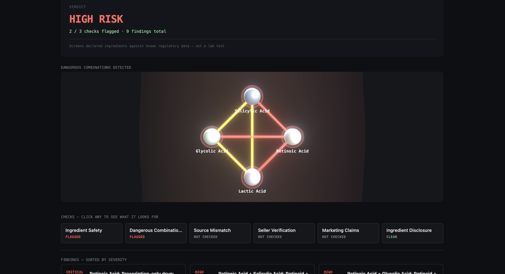
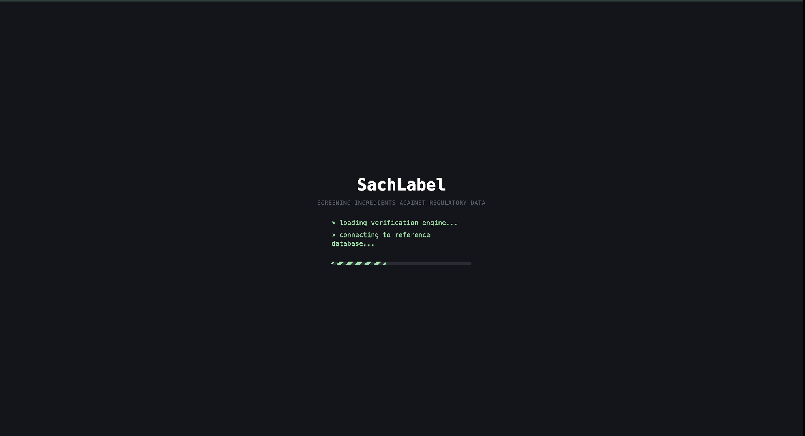
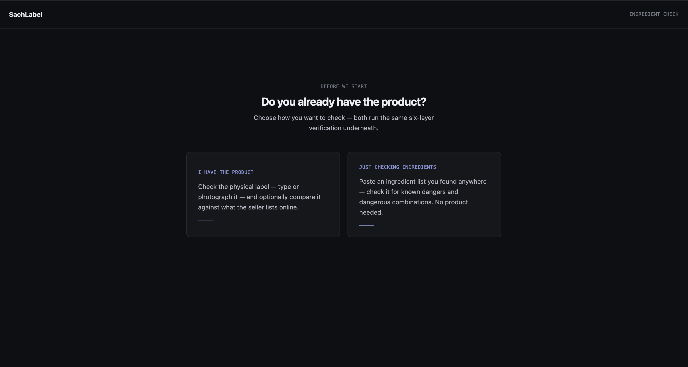
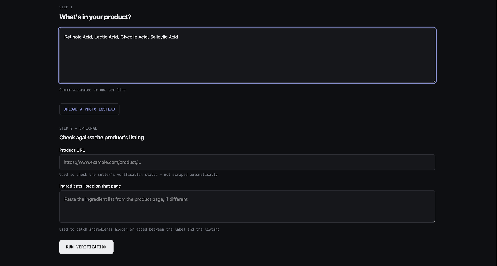
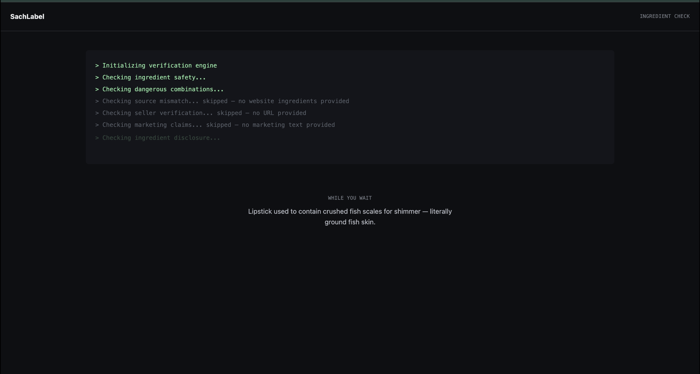
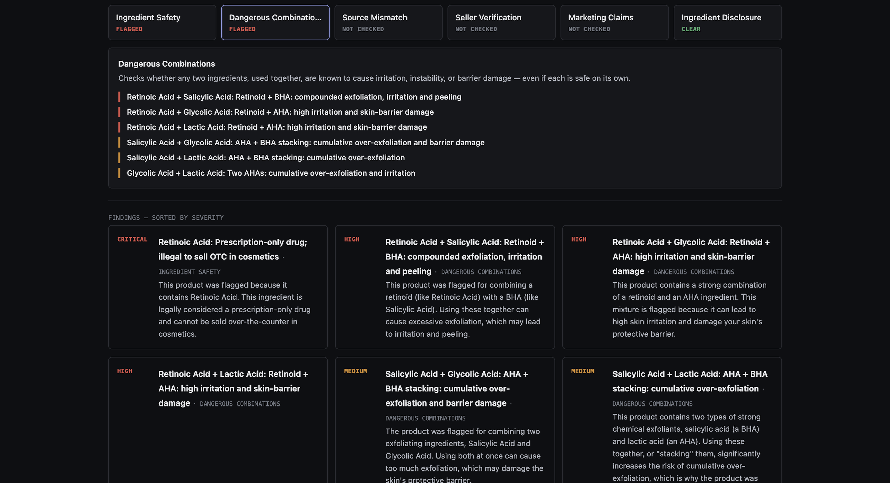

# SachLabel

**A cosmetic safety verifier that runs a product's ingredients through a six-layer
verification engine — checking regulatory blocklists, dangerous ingredient
combinations, and fraud signals — and returns a cited, fail-safe verdict.**

🔗 **Live demo:** [sachlabel.onrender.com](https://sachlabel.onrender.com)
_(hosted on a free tier — the first request may take ~50s while the backend wakes up,
then it's instant)_



---

## Why I built this

My mother used an over-the-counter face cream that contained **Retinoic Acid** — a
Schedule H *prescription-only* drug in India, illegal to sell in an OTC cosmetic. It was
sold directly by an influencer brand, and there was no way for her to check whether it
was safe or even legal before buying it.

SachLabel is the tool that would have caught it. You give it a product's ingredient list
— typed, or extracted from a photo of the label — and it screens every ingredient against
published regulatory prohibited-lists, flags dangerous combinations, and surfaces fraud
signals like a seller not on a verified platform or a label that doesn't match the
website.

## What it checks — the six layers

1. **Ingredient safety** — each ingredient against known regulatory blocklists: CDSCO
   Schedule H (prescription-only drugs), CDSCO-banned cosmetics, and EU CosIng Annex II
   (EU-prohibited substances).
2. **Dangerous combinations** — pairs of ingredients that are risky *together* even when
   each is fine alone (e.g. a retinoid + an AHA). Modeled as a graph.
3. **Source mismatch** — compares the physical label's ingredients against what the
   seller lists online, to catch anything hidden or added between the two.
4. **Seller verification** — whether the product is sold through a recognized, accountable
   platform vs. an influencer-direct channel with no accountability.
5. **Marketing claims** — scans marketing copy for illegal drug-style claims a cosmetic
   legally cannot make ("cures", "clinically proven", etc.).
6. **Ingredient disclosure** — flags vague terms like "Fragrance" that can legally hide
   undisclosed chemicals.

Results aggregate on a **worst-case-wins** basis — the overall verdict is driven by the
single most severe finding, never averaged.

## Core principle: this is a screening tool, not a lab test

SachLabel verifies **documents, not physical contents**. It answers *"does the declared
ingredient list contain a known-prohibited ingredient or a known-dangerous combination?"*
— it cannot detect an **undeclared** ingredient (an adulterant not printed on the label);
only a lab assay can.

It is a **blocklist**, not an allowlist. "No violations detected" means *"nothing on our
known-prohibited lists was found"* — it is **not** a certification that a product is safe.
Verdicts are cited to their regulatory source, and unknown ingredients are flagged for
review rather than assumed safe.

The AI (Gemini) is used **only** to read (OCR a label) and to explain a flag in plain
language — it **never** makes the safety decision. The authoritative verdict always comes
from the cited reference data. A hallucinated "this is safe" on a real drug would be the
single worst failure this tool could have, so it is architecturally prevented.

> ⚠️ The reference dataset is a curated starter set of widely-documented regulatory facts,
> not yet exhaustively verified against every primary source. Treat findings as a
> **triage signal that flags candidates for further verification**, not a legal verdict.

## Screenshots

A quick check needs no product — paste any ingredient list you found online, and watch all
six layers run.



**Choose your mode** — "I have the product" (check the physical label, optionally against
the seller's online listing) or "just checking ingredients."



**Enter the ingredients** — type them, or extract them from a photo of the label with OCR.



**Live verification** — every layer runs in real time, honestly showing which were skipped
and why.



**Cited findings** — every flag explained in plain language, sorted by severity, and each
check expandable to show exactly what it looks for.



## Tech stack

**PERN** — PostgreSQL · Express · React · Node (decoupled frontend/backend, not Next.js).

| Layer | Tech |
|---|---|
| Frontend | React + Vite + Tailwind CSS v4; Three.js / React Three Fiber (3D combination graph) |
| Backend | Node + Express 5 |
| Database | PostgreSQL + Prisma ORM |
| Cache | Redis (cache-aside for scrapes & AI calls; Redis-backed rate limiting) |
| AI | Google Gemini (`gemini-2.5-flash`) — OCR + flag explanations only |
| Validation | Zod (validation at the API boundary) |
| Testing | Jest + Supertest (41 tests) |
| CI/CD | GitHub Actions (Postgres + Redis service containers) |
| Deploy | Render |

## Some engineering decisions worth calling out

- **Dangerous combinations as a graph.** Ingredients are nodes, dangerous pairs are edges
  in an explicit self-referential join table, stored with canonical edge ordering
  (smaller id first) so each undirected pair is deduplicated by a composite unique index.
  Lookups are set-based with a JOIN — no N+1.
- **Synonym resolution via an alias table.** "Vitamin C" and "Ascorbic Acid" resolve to
  one canonical ingredient through a shared resolver used by two different services, so a
  synonym is caught everywhere, not patched per-service.
- **Fail-safe everywhere.** Absence of data is treated as UNKNOWN / flagged-for-review,
  never as "safe." A best-effort website scrape that returns nothing *skips* the mismatch
  check rather than fabricating a false "match."
- **AI reads and explains, never decides** (see above).
- **Cache expensive I/O, not cheap queries.** Web scrapes and AI calls are cached in Redis
  with TTLs; a failed call is never cached (it throws inside the cache-aside wrapper, so a
  transient error like an API quota limit is never served as a valid result).
- **Configuration via environment variables** — `DATABASE_URL`, `REDIS_URL`,
  `VITE_API_URL`, `CORS_ORIGIN` — so the same code runs locally and in production with no
  branching, and hosting can be swapped without a code change.

## Running locally

**Prerequisites:** Node, Docker (for Postgres + Redis).

```bash
# 1. Start Postgres + Redis
docker compose up -d

# 2. Backend
cd backend
cp .env.example .env        # then fill in DATABASE_URL (and GEMINI_API_KEY, optional)
npm install
npx prisma migrate deploy   # create the schema
npx prisma db seed          # load the reference data
npm run dev                 # http://localhost:3000

# 3. Frontend (in a second terminal)
cd frontend
npm install
npm run dev                 # http://localhost:5173 — proxies /api to the backend
```

`GEMINI_API_KEY` is **optional** — without it, OCR and AI explanations degrade gracefully
(the app still runs and returns cited verdicts from the database).

## Testing

```bash
cd backend
npm test
```

41 tests (Jest + Supertest): unit tests on every pure verifier, real-database tests for
the graph and alias resolution, and integration tests on the full `/api/verify-product`
flow with external services mocked. CI runs the whole suite against real Postgres + Redis
service containers on every push.

## Roadmap

- **Pre-purchase mode** — the engine already supports checking a product from just its
  URL + declared ingredients (before you own it); exposing this as a first-class mode is
  the next major direction.
- **Headless-browser scraping** (Puppeteer/Playwright) — the current scraper is
  static-HTML only, so JS-rendered storefronts return nothing and Layer 3 skips
  gracefully rather than guessing.
- **Reference-data completeness** — bulk-import the full EU CosIng Annex II list, log
  unknown ingredients to grow the blocklist, and verify every entry against its primary
  source.

## Disclaimer

SachLabel is an independent screening tool for educational and informational purposes. It
flags potential regulatory concerns for further verification; it does not provide medical,
legal, or safety certifications, and its reference data may be incomplete. Always verify
against official regulatory sources before acting on a result.
